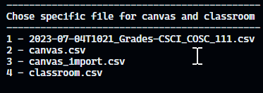
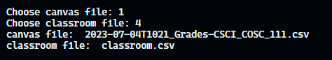

## Prepare Canvas File Import

Go to [Canvas](https://aupp.instructure.com/) and select course that you want to import grade to.

Go to grade and select assignment that will be sync with GitHub classroom grade, once done, export canvas grade with the current view

Place the exported data inside the root folder of this application.

## Prepare Git Hub Classroom File Import

Go to [GitHub Classroom](https://classroom.github.com/classrooms) and select course that you want to import grade to canvas.

Choose assignment that you want the grade to import to

Export the assignment grade to CSV file extention.

Place the exported data inside the root folder of this application.

## Migrate Grade From Github Classroom To Canvas

Run `main.py` to start the program.

Choose file for Canvas and file for Github Classroom

Once completed, number of record affected will shown for you to confirm and the file is save in the name of `canvas_import.csv`

## Import Grade To Canvas

Go back to canvas -> grade, under Action click on Import

Click on Choose File and browser to the converted file from the above process, once done, click on Upload Data to proceed with the upload.

Confirm with the grade comparison that canvas listed, to complete.
